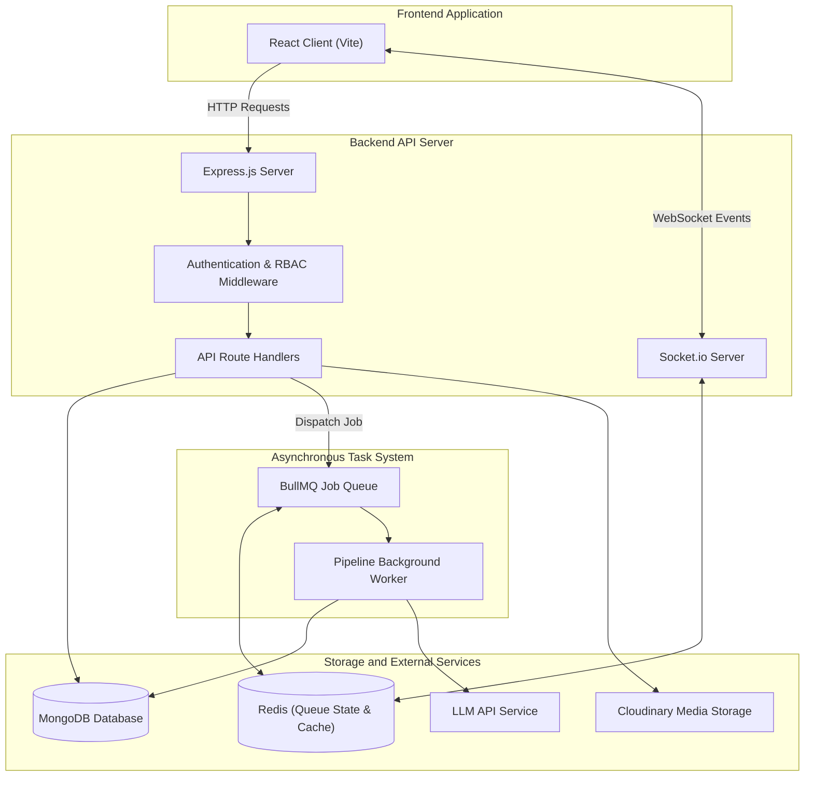

# Storyloom

## Project Description

Storyloom is a web platform for writers, readers, and book publishers. Writers can upload manuscript drafts in formats such as PDF, Word (DOCX), or plain text. The platform extracts the text and runs an asynchronous background pipeline that breaks the manuscript into individual scenes and extracts story elements, including character profiles, character relationships, narrative timeline events, emotional tone, and potential continuity issues.

Readers can browse published manuscripts, save reading progress, submit reviews, and use a story question-answering assistant that answers questions using only the chapters the reader has read, preventing spoilers.

Publishers can discover manuscripts using catalog filters, review standardized book pitch cards, and make acquisition offers directly to writers. Once an offer is accepted, writers and publishers communicate through a real-time chat with automatic masking of private contact details (phone numbers and email addresses) to maintain author privacy. Administrators manage user accounts, review publisher applications, and resolve moderation reports.

## Tech Stack

| Layer / Role | Technology | Purpose |
| --- | --- | --- |
| Frontend | React 19 | Client application, page routing, and view state management |
| Build Tool | Vite | Development server and client production bundling |
| Backend Server | Node.js, Express.js | REST API routing, request validation, and application logic |
| Database | MongoDB, Mongoose | Primary document database for users, books, and analysis data |
| Queue and Cache | Redis, BullMQ | Asynchronous job queues for manuscript processing and worker tasks |
| Real-Time Communication | Socket.io | Live author-publisher chat and asynchronous pipeline status events |
| Document Extraction | pdf-parse, Mammoth | Parsing raw text from PDF, Word (DOCX), and text files |
| Authentication | JSON Web Tokens (JWT), bcryptjs | Secure password hashing and stateless token-based authorization |
| Media Storage | Cloudinary, Multer | Manuscript file upload handling and book cover image hosting |
| AI Integration | LLM API | Narrative analysis, metadata extraction, and story question answering |

## Key Features

### Manuscript Analysis Pipeline
- Multi-format file upload support for PDF, Word (.docx), and plain text (.txt).
- Automatic scene segmentation with generated titles, summaries, and word counts.
- Character extraction identifying names, narrative roles (protagonist, antagonist, supporting), personality traits, and aliases.
- Relationship mapping detecting connections and interaction types between characters.
- Story timeline generation organizing plot events in chronological order.
- Emotional tone tracking measuring scene intensity and mood patterns.
- Plot continuity checks scanning for narrative discrepancies across scenes.
- Automated book pitch generation creating loglines, target demographics, and market hooks.

### Reading Experience and Spoiler Protection
- Distraction-free reader view with adjustable typography and reading modes.
- Personal library tracking for currently reading, saved, and completed books.
- Community reviews with five-star ratings and reader feedback.
- Contextual question-answering assistant that retrieves relevant scene excerpts to answer reader questions while restricting information to scenes already completed by the reader.

### Publisher Discovery and Acquisition
- Search and filtering by genre, word count, reader completion rates, and average rating.
- Book pitch cards summarizing core themes, audience fit, and comparable stories.
- Acquisition offer workflow allowing publishers to specify advance payments, royalties, and rights categories.
- Real-time author-publisher negotiation chat with automated masking of sensitive contact details until both parties consent.

### Administration and Safety
- Administrative dashboard displaying platform activity, registered users, and active books.
- Publisher verification pipeline to approve or decline publishing house accounts.
- Moderation queue for handling reported content, user disputes, and book takedowns.
- Audit logging tracking administrative actions for platform transparency.

## System Architecture



### Architecture Data Flow
1. The client sends authenticated HTTP requests to Express route handlers and establishes a WebSocket connection with Socket.io for live chat and processing alerts.
2. When a manuscript is uploaded, the file is saved and Express dispatches a job to the BullMQ processing queue in Redis.
3. The background worker pulls the job from Redis, runs text extraction, and processes the story through sequential analysis stages.
4. During analysis, the worker makes structured prompts to the LLM API to extract characters, scenes, emotional arcs, and pitch details.
5. All generated analysis documents, book records, and user profiles are stored in MongoDB.
6. The worker emits completion events through Socket.io back to the client to update the user interface without a page reload.

## Project Structure

```text
Storyloom/
├── backend/
│   ├── scripts/          # Database seeding, migration, and maintenance utility scripts
│   ├── src/
│   │   ├── analysis/     # Rule-based text analysis, tokenizers, and similarity math
│   │   ├── config/       # Environment variables, database, and Redis configuration
│   │   ├── constants/    # User roles, pipeline stage definitions, and system constants
│   │   ├── controllers/  # Route controllers processing incoming requests and responses
│   │   ├── middleware/   # JWT authentication, role-based authorization, and error handling
│   │   ├── models/       # Mongoose schemas for books, users, scenes, and analysis entities
│   │   ├── parsers/      # Text extraction utilities for PDF, Word, and text files
│   │   ├── queues/       # BullMQ queue declarations for asynchronous jobs
│   │   ├── repositories/ # Data access layer abstracting MongoDB queries
│   │   ├── routes/       # Express route definitions for all public and private endpoints
│   │   ├── services/     # Core business logic, search services, and AI orchestration
│   │   ├── socket/       # Socket.io event listeners for real-time messaging
│   │   ├── utilities/    # Logger instances, custom error classes, and response formatters
│   │   ├── validators/   # Joi schema validation rules for incoming request payloads
│   │   ├── workers/      # BullMQ background worker executing the manuscript pipeline
│   │   ├── app.js        # Express application setup, security middleware, and route mounting
│   │   └── server.js     # Entry point initializing HTTP server, WebSockets, and database
│   └── tests/            # Automated test suites for routes, auth, and pipeline features
└── frontend/
    ├── public/           # Static icons, brand logos, and public web assets
    ├── src/
    │   ├── components/   # Reusable views, modal dialogues, and story detail tabs
    │   ├── constants/    # Frontend application routes and shared lookup tables
    │   ├── context/      # React context providers managing user authentication
    │   ├── hooks/        # Custom React hooks for pipeline polling and API calls
    │   ├── layouts/      # Base layouts providing navigation headers and sidebars
    │   ├── pages/        # Route page views for readers, writers, publishers, and admins
    │   ├── services/     # HTTP API request wrappers and WebSocket client connection
    │   ├── utils/        # Helper functions for formatting, validation, and route guards
    │   ├── App.jsx       # Root component configuring application router and page routes
    │   ├── index.css     # Global styles and typography definitions
    │   └── main.jsx      # Application entry point mounting React into the DOM
    ├── index.html        # HTML template entry point
    └── vite.config.js    # Vite configuration file with dev server proxy settings
```

## API Overview

### Authentication and Account
| Method | Endpoint | Description |
| --- | --- | --- |
| POST | `/api/auth/register` | Register a new user account with role selection |
| POST | `/api/auth/login` | Authenticate user and issue JWT tokens |
| POST | `/api/auth/logout` | Revoke session tokens and log out user |
| POST | `/api/auth/refresh-token` | Exchange refresh token for a new access token |
| GET | `/api/auth/me` | Fetch authenticated user profile data |

### Books and Manuscripts
| Method | Endpoint | Description |
| --- | --- | --- |
| GET | `/api/books` | List published books with filtering and pagination |
| GET | `/api/books/:id` | Retrieve single book details and published metadata |
| POST | `/api/books` | Create a new book record with uploaded manuscript |
| PATCH | `/api/books/:id` | Update book title, blurb, tags, or publishing status |
| DELETE | `/api/books/:id` | Delete an unpublished draft or owned book |
| POST | `/api/upload` | Upload manuscript files (PDF, DOCX, TXT) and cover artwork |

### Story Analysis and Processing
| Method | Endpoint | Description |
| --- | --- | --- |
| POST | `/api/books/:id/analysis/process` | Trigger asynchronous pipeline analysis on a book |
| GET | `/api/books/:id/analysis/pipeline-status` | Get current background job progress and step state |
| GET | `/api/books/:id/analysis/scenes` | Retrieve extracted scenes with spoiler filtering |
| GET | `/api/books/:id/analysis/characters` | Retrieve extracted character profiles and roles |
| GET | `/api/books/:id/analysis/relationships` | Retrieve mapped character relationship pairs |
| GET | `/api/books/:id/analysis/timeline` | Retrieve chronological narrative timeline events |
| GET | `/api/books/:id/analysis/mood` | Retrieve emotional arc tracking and intensity data |
| GET | `/api/books/:id/analysis/continuity` | Retrieve detected plot consistency issues |
| GET | `/api/books/:id/analysis/pitch` | Retrieve generated publisher pitch deck details |
| POST | `/api/books/:id/analysis/ask` | Submit questions to the spoiler-protected Q&A assistant |

### Reading and Reviews
| Method | Endpoint | Description |
| --- | --- | --- |
| GET | `/api/me/library` | Retrieve user reading list, bookmarks, and read history |
| POST | `/api/me/library/progress` | Update current reading progress offset and page number |
| GET | `/api/reviews/book/:bookId` | List reviews and star ratings for a book |
| POST | `/api/reviews` | Submit a reader review and rating |
| DELETE | `/api/reviews/:id` | Remove a submitted review |

### Publisher Acquisition and Real-Time Chat
| Method | Endpoint | Description |
| --- | --- | --- |
| GET | `/api/publisher/discover` | Search manuscripts with publishing metrics |
| POST | `/api/publish-requests` | Submit formal acquisition offer to a writer |
| PATCH | `/api/publish-requests/:id` | Accept, reject, or update an acquisition offer |
| GET | `/api/conversations` | List active user negotiation conversations |
| GET | `/api/conversations/:id/messages` | Retrieve conversation message history |
| POST | `/api/conversations/:id/messages` | Send chat message with automated contact masking |

### Administration
| Method | Endpoint | Description |
| --- | --- | --- |
| GET | `/api/admin/stats` | Retrieve platform-wide KPIs, user counts, and book stats |
| GET | `/api/admin/users` | List and search registered accounts |
| PATCH | `/api/admin/users/:id` | Update user status, strike count, or suspension |
| GET | `/api/admin/publishers` | Review pending publisher verification requests |
| PATCH | `/api/admin/publishers/:id` | Approve or reject a publisher application |
| GET | `/api/admin/reports` | List open moderation reports |
| PATCH | `/api/admin/reports/:id` | Resolve moderation report and execute disciplinary action |
