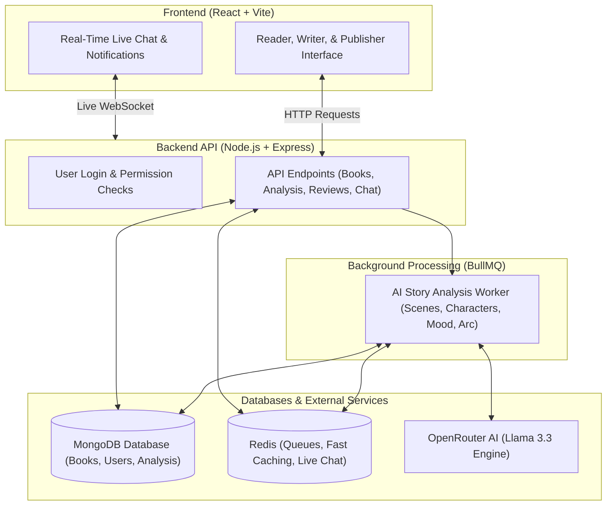

# Storyloom — Intelligent Story Reading & Publishing Platform

> **From Draft to Published Book.** Storyloom is a complete web platform that brings together writers, readers, and book publishers. It takes written manuscripts, turns them into clean digital books, and uses AI to map out characters, timelines, and emotional arcs. Readers can enjoy books without spoilers, writers get automated feedback on their plots, and publishers can discover new talent with ready-made pitch cards.

[](https://github.com)
[](https://github.com)
[](https://github.com)
[](LICENSE)

---

## 📋 Table of Contents
- [Overview](#-overview)
- [Key Highlights](#-key-highlights)
- [Platform Features](#-platform-features)
  - [1. Story Analysis Engine](#1-story-analysis-engine)
  - [2. Reader Experience & In-Story AI](#2-reader-experience--in-story-ai)
  - [3. Publisher Discovery & AI Pitch Deck](#3-publisher-discovery--ai-pitch-deck)
  - [4. Book Offers & Real-Time Negotiation Chat](#4-book-offers--real-time-negotiation-chat)
  - [5. Platform Administration & Safety](#5-platform-administration--safety)
- [System Architecture](#-system-architecture)
- [Demo Accounts](#-demo-accounts)
- [Environment Setup](#-environment-setup)
- [Installation & Quick Start](#-installation--quick-start)
- [Testing](#-testing)
- [License](#-license)

---

## 🌟 Overview

Storyloom simplifies the path from writing a manuscript to finding an audience and landing a publishing deal:

1. **Writers**: Upload raw manuscripts in PDF, Word, or plain text format. Storyloom automatically organizes the text into chapters and scenes, scans the plot for inconsistencies, and breaks down character relationships and emotional arcs.
2. **Readers**: Enjoy clean, distraction-free reading with saved bookmarks, reading lists, community reviews, and an interactive "Ask AI" companion to clarify story details.
3. **Publishers**: Browse promising manuscripts using filters like genre, reader completion rate, and ratings. View AI-generated pitch summaries and send formal book acquisition offers directly to authors.
4. **Dealmaking & Chat**: Authors and publishers negotiate directly through live chat. Personal contact details (emails, phone numbers) are kept hidden to protect authors until both sides agree to share them.
5. **Administrators**: Keep the community safe by reviewing user reports, moderating content, and managing platform activity.

---

## ⚡ Key Highlights

| Feature | How It Works in Plain Words |
|---|---|
| 🧠 **Step-by-Step AI Story Analysis** | When a manuscript is uploaded, background jobs automatically analyze it stage by stage: breaking down scenes, identifying characters, mapping relationships, and tracing the emotional arc. |
| 🙈 **Spoiler-Protected Insights** | Readers only see character details and plot points up to the page they have read. Crucial twists stay hidden until you reach that scene, with a toggle if you want to reveal everything. |
| 🌐 **Hindi & English Story Intelligence** | Understands the original language of your manuscript. Hindi stories receive character summaries and emotional insights naturally in Hindi, while keeping the website interface in English. |
| 🛡️ **Safe Author-Publisher Chat** | Authors and publishers can chat in real time about book deals. The system automatically hides emails and phone numbers until the author chooses to share them. |
| 📊 **AI Pitch Cards for Scouts** | Gives busy publishers an instant summary: a one-line hook, comparable popular books, target audience, and market viability scores. |
| ⚡ **Live Auto-Refresh** | When AI analysis finishes in the background, your story insights appear automatically on your screen without having to reload the browser. |

---

## ✨ Platform Features

### 1. Story Analysis Engine
* **Automatic Scene Breakdown**: Divides full manuscripts into natural scenes with scene titles, summaries, and word counts.
* **Character Profiling**: Discovers who is in the story, their roles (protagonist, antagonist, supporting), personality traits, and nicknames.
* **Character Relationship Web**: Generates an interactive visual network showing who knows whom and how they interact.
* **Story Timeline & Tension Arc**: Tracks key events chronologically and graphs the rise and fall of story tension toward the climax.
* **Continuity & Plot Hole Checker**: Scans across scenes to catch plot inconsistencies, character description errors, or timeline gaps.

### 2. Reader Experience & In-Story AI
* **Clean Reading View**: Adjustable font sizing, dark/light reading modes, and automatic progress saving so you never lose your place.
* **Personal Library**: Track what you are currently reading, want to read, or have completed.
* **Community Reviews**: Share honest feedback, leave 1-to-5 star ratings, and view rating breakdowns.
* **Ask AI Assistant**: A helpful in-reader chat assistant that answers questions about story lore, past scenes, or character backgrounds based directly on the book's text.

### 3. Publisher Discovery & AI Pitch Deck
* **Search & Filters**: Find books by genre, reader completion percentage, reading time, word count, and rating.
* **Instant Pitch Decks**: AI creates Hollywood-style loglines, "For Fans Of" comparable titles, target age groups, and selling points.
* **Private Watchlists**: Publishers can save manuscripts to a private list. Authors see total interest count without knowing who saved it until an offer is made.
* **Author Profiles**: Public profile pages showcasing an author’s published books, biography, and follower count.

### 4. Book Offers & Real-Time Negotiation Chat
* **Acquisition Offers**: Publishers can propose advance amounts, royalty percentages, and rights (print, ebook, audio, film/TV, translation).
* **Author Decisions**: Authors can accept an offer (which instantly opens a private negotiation chat), politely decline, or block bad-faith senders.
* **Live Chat with Safety Shield**: Talk in real time with message receipts. Personal contact info is masked automatically until explicitly shared.
* **"In Talks" Status**: Books actively negotiating an offer display an "In Talks" badge in the catalog.

### 5. Platform Administration & Safety
* **Dashboard Overview**: Track active readers, published books, pending publisher applications, and open community reports.
* **User & Content Moderation**: Manage user accounts, review reported manuscripts or messages, and handle suspensions or content takedowns.
* **Transparent Activity Logs**: Important administrative decisions are saved to an activity log for accountability.

---

## 🏗️ System Architecture



---

## 🔑 Demo Accounts

To test Storyloom with realistic sample books, reviews, offers, and chat messages, seed the database with demo data:

```bash
cd backend
npm run seed:demo
```

### Ready-To-Use Accounts:
| Role | Email | Password | What You Can Do |
|---|---|---|---|
| 👑 **Administrator** | `admin@scenecraft.com` | `Password123!` | View platform stats, manage users, and handle moderation reports |
| 🏢 **Publisher** | `publisher@scenecraft.com` | `Password123!` | Search books, read pitch cards, send offers, and chat with authors |
| ✍️ **Author** | `writer@scenecraft.com` | `Password123!` | Upload manuscripts, view AI story insights, and publish stories |
| ✍️ **Author (In Talks)** | `kai.sterling@scenecraft.com` | `Password123!` | Author with an active publisher offer and live negotiation chat |
| 📖 **Reader** | `reader@scenecraft.com` | `Password123!` | Read books, save bookmarks, write reviews, and use "Ask AI" |

---

## 🔑 Environment Setup

### Backend Configuration (`backend/.env`):
```env
PORT=5000
NODE_ENV=development
CORS_ORIGIN=http://localhost:3000,http://localhost:5173

# Database Connection
MONGO_URI=mongodb+srv://<username>:<password>@cluster.mongodb.net/storyloom
REDIS_URL=redis://127.0.0.1:6379

# Authentication Tokens
JWT_ACCESS_SECRET=your_jwt_access_secret_key
JWT_REFRESH_SECRET=your_jwt_refresh_secret_key

# AI Provider (OpenRouter)
OPENROUTER_API_KEY_1=your_openrouter_api_key
OPENROUTER_MODEL_1=meta-llama/llama-3.3-70b-instruct
```

### Frontend Configuration (`frontend/.env`):
```env
VITE_API_URL=http://localhost:5000/api
```

---

## ⚡ Installation & Quick Start

### What You Need First:
- **Node.js** (v18 or newer installed)
- **MongoDB** (running locally or a free MongoDB Atlas cloud database)
- **Redis** (running locally or via Docker on port 6379)

### 1. Install Dependencies
```bash
# Clone the repository
git clone https://github.com/Samiksha-Lohia/Storyloom.git
cd Storyloom

# Install backend dependencies
cd backend
npm install

# Install frontend dependencies
cd ../frontend
npm install
```

### 2. Seed the Demo Database
```bash
cd ../backend
npm run seed:demo
```

### 3. Start the Apps
```bash
# Terminal 1: Backend Server (runs on port 5000)
cd backend
npm run dev

# Terminal 2: Frontend App (runs on port 3000 or 5173)
cd ../frontend
npm run dev
```

Open your browser and navigate to **`http://localhost:3000`** (or the port shown in your terminal) to explore Storyloom.

---

## 🧪 Testing

Run backend tests and check code quality:

```bash
# Run backend tests
cd backend
npm test

# Check frontend for any issues and build bundle
cd ../frontend
npm run build
```

---

## 📜 License

This project is licensed under the **MIT License**.
