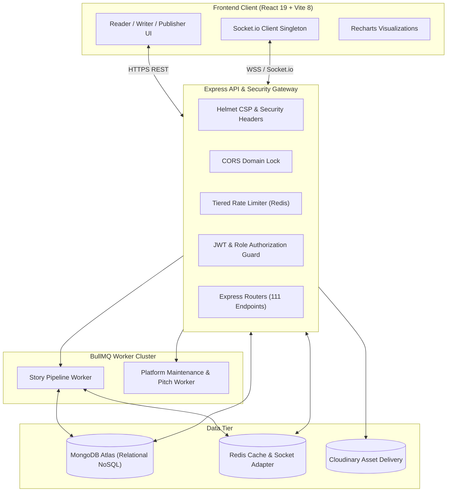

# SceneCraft — AI-Powered Interactive Story & Literary Publishing Platform

> **From Draft to Deal.** SceneCraft is an end-to-end literary platform connecting independent authors with professional acquisitions editors. Powered by a multi-stage background job-queue pipeline, SceneCraft transforms raw narrative manuscripts into structured, interactive story analyses, generates AI-powered publisher pitch cards, enables real-time negotiation chat with contact safety guardrails, and provides comprehensive administrative governance.

[](https://github.com)
[](https://github.com)
[](https://github.com)
[](https://github.com)

---

## 📋 Table of Contents
- [Overview](#-overview)
- [Key Architectural Highlights](#-key-architectural-highlights)
- [Platform Feature Modules](#-platform-feature-modules)
  - [1. Story Analysis Engine (Phases 1–7)](#1-story-analysis-engine)
  - [2. Publisher Discovery & Pitch Deck (Phase 8)](#2-publisher-discovery--pitch-deck)
  - [3. Publish Request & Rights Negotiation (Phase 9)](#3-publish-request--rights-negotiation)
  - [4. Real-Time Secure Chat & Safety Controls](#4-real-time-secure-chat--safety-controls)
  - [5. Platform Hardening & Admin Suite (Phase 10)](#5-platform-hardening--admin-suite)
- [System Architecture](#-system-architecture)
- [Interactive Demo & Credentials](#-interactive-demo--credentials)
- [Environment Variables](#-environment-variables)
- [Installation & Quick Start](#-installation--quick-start)
- [Testing & Quality Assurance](#-testing--quality-assurance)
- [API Route Directory](#-api-route-directory)
- [Production Deployment](#-production-deployment)
- [License](#-license)

---

## 🌟 Overview

SceneCraft bridges the gap between literary creation and commercial acquisition:
1. **Writers** upload manuscripts (`.pdf`, `.docx`, `.txt`) and receive granular structural, character, timeline, and tension breakdowns alongside interactive reader feedback and readership analytics.
2. **Publishers** browse the curated catalogue with advanced acquisitions filters (completion rate, reading time, wishlist status), review AI-generated pitch cards, maintain private portfolios, and submit formal rights acquisition offers.
3. **Collaboration & Dealmaking** occurs through real-time negotiated messaging guarded by Redis-backed rate limiting and automated contact-info masking until the author explicitly permits direct off-platform contact.
4. **Trust & Safety Officers** monitor platform health, review automated and user-submitted reports, audit reported chat transcripts with immutable logging, and enforce suspensions or content takedowns.

---

## ⚡ Key Architectural Highlights

| Pillar | Engineering Implementation |
|---|---|
| ⛓️ **Dependency-Aware Job Graph** | BullMQ + Redis task management scheduling dependent analysis stages (e.g. mapping relationships *after* character profiles are extracted). |
| 📊 **Real-Time Stage Streaming** | Socket.io progress updates that stream status of the processing pipeline directly to the client as jobs complete. |
| 🛡️ **Zero-Bypass Safety Controls** | Socket identity authenticated strictly via JWT. In-memory and Redis token bucket limiting messaging (20 msgs/min). Deterministic contact filtering (regex for emails, phone numbers, and web domains) protecting unpublished creators. |
| 🔍 **Audited Admin Moderation** | Admin access to private negotiations is strictly prohibited unless tied to an active moderation report; every inspection is immutably logged to MongoDB `AuditLog`. |
| ⚡ **Redis Catalogue Caching** | High-traffic `GET /api/books` queries cached with 60-second TTL and automatic invalidation on book updates or moderation takedowns. |
| 📦 **Optimized Client Delivery** | Manual vendor code-splitting isolates heavy dependencies (`recharts`, `framer-motion`, `lucide-react`), cutting primary JS bundle weight to ~540 kB. |

---

## ✨ Platform Feature Modules

### 1. Story Analysis Engine
- **Scene Breakdown**: Identifies scene boundaries from narrative and structural cues with direct text-offset jumps.
- **Character Resolution & Tracking**: Discovers cast members, nicknames, dynamic traits, and temporal sentiment shifts.
- **Story Timeline & Arc**: Dual-axis chronological vs. narrative ordering and Recharts-powered narrative tension curves.
- **Continuity Auditor**: Scans for plot inconsistencies, anachronisms, and attribute drifts across chapters.

### 2. Publisher Discovery & Pitch Deck
- **Publisher Application & Review**: Publishers apply with company credentials and undergo administrative vetting.
- **Acquisitions Pitch Deck**: AI generates high-impact loglines, comparable titles ("For Fans Of"), target demographic profiles, and commercial hooks.
- **Private Wishlists**: Publishers maintain confidential portfolios; authors see aggregate interest counts without revealing publisher identities.
- **Author Profiles & Social Follow**: Public author showcases with catalogued bibliography, social links, and real-time followers.

### 3. Publish Request & Rights Negotiation
- **Formal Acquisition Offers**: Publishers propose advances, royalty terms, and selective rights (`print`, `ebook`, `audiobook`, `translation`, `film_tv_web`).
- **Author Decision Workflow**: Authors can accept offers (instantly provisioning a dedicated real-time chat), decline with a 30-day cooldown, or block bad-faith publishers.
- **Manuscript "In Talks" Badge**: Once an offer is accepted, the book displays an "In Talks" badge in the discovery catalogue.

### 4. Real-Time Secure Chat & Safety Controls
- **Socket.io Singleton Architecture**: Room-based messaging (`conversation:{id}`) with real-time optimistic delivery and message status acknowledgements (`readAt`).
- **Contact-Filter Shield**: Automatically detects and redacts emails, URLs, and phone numbers in prose unless the author toggles `contactSharingEnabled`.
- **Live Typing Indicators & Unread Badges**: Real-time presence indicators with notification badge counts synced across sessions.

### 5. Platform Hardening & Admin Suite
- **Comprehensive Analytics Dashboard**: Live metrics for DAU/WAU, signup velocity, manuscript status distribution, pending publisher reviews, and open trust & safety reports.
- **User Governance**: Searchable user directory with role migration, temporary suspension (auto-suspending author books), and permanent bans.
- **Manuscript Moderation**: Content takedown and restoration workflows notifying authors with audited justification records.
- **Resilience & UX Completeness**: Full-coverage `ErrorBoundary`, 403 Forbidden role guards, and standardized 404 recovery states.

---

## 🏗️ System Architecture



---

## 🔑 Interactive Demo & Credentials

The database can be seeded instantly with realistic multi-chapter manuscripts, reviews, wishlists, offers, and chat exchanges:

```bash
# In backend directory
npm run seed:demo
```

### Pre-Configured Demo Accounts:
| Role | Email | Password | Details |
|---|---|---|---|
| 👑 **Administrator** | `admin@scenecraft.com` | `Password123!` | Full moderation & platform analytics access |
| 🏢 **Publisher (Approved)** | `publisher@scenecraft.com` | `Password123!` | Apex Literary Publishing (Acquisitions Editor) |
| ⏳ **Publisher (Pending)** | `pending.publisher@scenecraft.com` | `Password123!` | Starlight Books (Awaiting Admin Review) |
| ✍️ **Author (Bestseller)** | `writer@scenecraft.com` | `Password123!` | Elena Vance (Speculative fiction author) |
| ✍️ **Author (In Talks)** | `kai.sterling@scenecraft.com` | `Password123!` | Kai Sterling (Active offer & negotiation chat) |
| 📖 **Reader (Community)** | `reader@scenecraft.com` | `Password123!` | Alex Reader (Full reading, review, library access) |
| 📖 **Reader (Verified)** | `clara.reader@scenecraft.com` | `Password123!` | Clara Page (Reader & fiction enthusiast) |

---

## 🔑 Environment Variables

### Backend Configuration (`backend/.env`):
```env
NODE_ENV=development
PORT=5000
FRONTEND_URL=http://localhost:5173

# Databases
MONGO_URI=mongodb+srv://<user>:<password>@cluster.mongodb.net/scenecraft
REDIS_URL=redis://127.0.0.1:6379

# Authentication
JWT_SECRET=super_secret_jwt_key_min_32_chars_long
JWT_EXPIRES_IN=7d

# AI Providers
OPENROUTER_API_KEY=sk-or-v1-...
GEMINI_API_KEY=AIzaSy...
GROQ_API_KEY=gsk_...

# Asset Storage (Optional for production covers)
CLOUDINARY_CLOUD_NAME=your_cloud_name
CLOUDINARY_API_KEY=your_cloudinary_key
CLOUDINARY_API_SECRET=your_cloudinary_secret
```

### Frontend Configuration (`frontend/.env`):
```env
VITE_API_URL=http://localhost:5000/api
VITE_WS_URL=http://localhost:5000
```

---

## ⚡ Installation & Quick Start

### Prerequisites
- Node.js (v18.0.0 or higher)
- MongoDB instance running locally or on MongoDB Atlas
- Redis server active on port 6379

### 1. Installation
```bash
git clone https://github.com/Samiksha-Lohia/SceneCraft.git
cd SceneCraft

# Install backend dependencies
cd backend && npm install

# Install frontend dependencies
cd ../frontend && npm install
```

### 2. Seed Demo Data
```bash
cd backend
npm run seed:demo
```

### 3. Run Development Servers
```bash
# Terminal 1: Backend API & Socket Server
cd backend
npm run dev

# Terminal 2: Frontend Client
cd frontend
npm run dev
```
Open **`http://localhost:5173`** to access SceneCraft.

---

## 🧪 Testing & Quality Assurance

SceneCraft features an automated integration and security test suite using Node's native test runner:

```bash
# Run backend test suite
cd backend
npm test

# Run route security audit
node --experimental-test-module-mocks --test tests/routes-audit.test.js

# Run frontend linting & production build
cd ../frontend
npm run lint
npm run build
```

- **Routes Audit**: Validates that all 111 Express API endpoints possess valid authentication and role enforcement guards.
- **Phase 9 Test Suite**: Validates request state transitions, cooldown windows, socket message delivery, contact filtering, and audited conversation inspections.

---

## 🗺️ API Route Directory

All 111 API endpoints across all services are catalogued with parameter schemas and role permissions in:
👉 **[`docs/ROUTES.md`](docs/ROUTES.md)**

---

## 🚀 Production Deployment

Before deploying to production, review the comprehensive pre-flight verification checklist in:
👉 **[`docs/LAUNCH.md`](docs/LAUNCH.md)**

Covering:
- Environment secrets rotation & MongoDB Atlas IP whitelisting
- Compound database index confirmation
- Redis persistence & Redis Sentinel configuration
- Cloudflare SSL/HSTS and CDN caching policies
- Legal compliance (Terms of Service, DMCA reporting, Privacy Policy)

---

## 📜 License

Distributed under the **MIT License**. See `LICENSE` for details.
