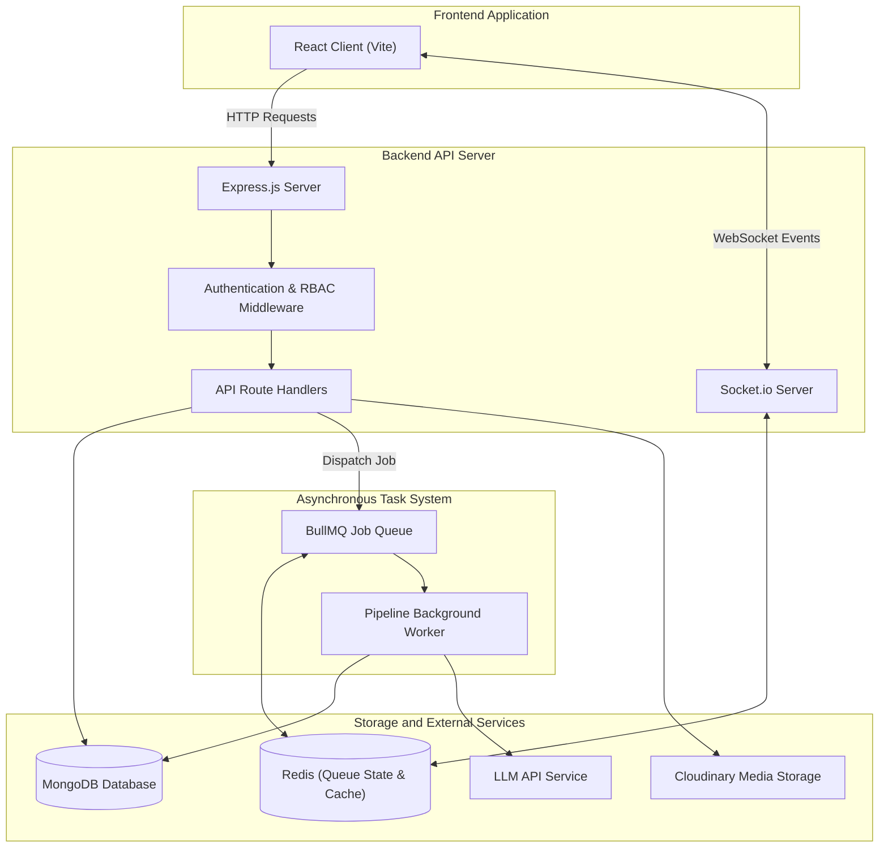

# Storyloom

## Project Description

Storyloom is a web platform for writers, readers, and book publishers. Writers can upload manuscript drafts in formats such as PDF, Word (DOCX), or plain text. The platform extracts the text and runs an asynchronous background pipeline that breaks the manuscript into individual scenes and extracts story elements, including character profiles, character relationships, narrative timeline events, emotional tone, and potential continuity issues.

Readers can browse published manuscripts, save reading progress, submit reviews, and use an interactive story question-answering assistant that evaluates the story text directly to provide accurate, grounded answers without hallucinations or assumptions.

Publishers can discover manuscripts using catalog filters, review standardized book pitch cards, and make acquisition offers directly to writers. Once an offer is accepted, writers and publishers communicate through a real-time chat with automatic masking of private contact details (phone numbers and email addresses) to maintain author privacy. Administrators manage user accounts, review publisher applications, and resolve moderation reports.

## Tech Stack

| Layer / Role | Technology | Purpose |
| --- | --- | --- |
| Frontend | React 19 | Client application, page routing, and view state management |
| Build Tool | Vite | Development server and client production bundling |
| Backend Server | Node.js, Express.js | REST API routing, request validation, and application logic |
| Database | MongoDB, Mongoose | Primary document database for users, books, and analysis data |
| Queue and Cache | Redis, BullMQ | Asynchronous job queues for manuscript processing and worker tasks |
| Real-Time Communication | Socket.io | Live author-publisher chat and asynchronous pipeline status events |
| Document Extraction | pdf-parse, Mammoth | Parsing raw text from PDF, Word (DOCX), and text files |
| Authentication | JSON Web Tokens (JWT), bcryptjs | Secure password hashing and stateless token-based authorization |
| Media Storage | Cloudinary, Multer | Manuscript file upload handling and book cover image hosting |
| AI Integration | LLM API | Narrative analysis, metadata extraction, and story question answering |

## Key Features

### Manuscript Analysis Pipeline
- Multi-format file upload support for PDF, Word (.docx), and plain text (.txt).
- Automatic scene segmentation with generated titles, summaries, and word counts.
- Character extraction identifying names, narrative roles (protagonist, antagonist, supporting), personality traits, and aliases.
- Interactive character relationship network featuring dual view modes (ReactFlow graph with character node focus and clean cards view), type pills with live counts, character dropdown, sentiment tone filters, and live search.
- Story timeline generation organizing plot events in chronological order.
- Emotional tone tracking measuring scene intensity and mood patterns.
- Plot continuity checks scanning for narrative discrepancies across scenes.
- Automated book pitch generation creating loglines, target demographics, and market hooks.
- One-click story re-analysis enabling authors to re-run and synchronize insights on both new and existing stories.

### Reading Experience and Grounded Story Q&A
- Distraction-free reader view with adjustable typography and reading modes.
- Personal library tracking for currently reading, saved, and completed books.
- Community reviews with five-star ratings and reader feedback.
- Grounded Story Q&A assistant utilizing a line-by-line RAG pipeline that evaluates verbatim manuscript text with bilingual English and Hindi (Devanagari) keyword scoring, multi-turn history, and strict anti-hallucination guardrails.

### Publisher Discovery and Acquisition
- Search and filtering by genre, word count, reader completion rates, and average rating.
- Book pitch cards summarizing core themes, audience fit, and comparable stories.
- Acquisition offer workflow allowing publishers to specify advance payments, royalties, and rights categories.
- Real-time author-publisher negotiation chat with automated masking of sensitive contact details until both parties consent.

### Administration and Safety
- Administrative dashboard displaying platform activity, registered users, and active books.
- Publisher verification pipeline to approve or decline publishing house accounts.
- Moderation queue for handling reported content, user disputes, and book takedowns.
- Audit logging tracking administrative actions for platform transparency.

## System Architecture



## Project Structure

```text
Storyloom/
├── backend/
│   ├── src/controllers/  # Request handlers for authentication, books, and analytics
│   ├── src/models/       # Mongoose schemas for users, books, scenes, and insights
│   ├── src/routes/       # Express API routes for public and protected endpoints
│   ├── src/services/     # Business logic, narrative analysis, and AI orchestration
│   ├── src/workers/      # BullMQ background worker executing the analysis pipeline
│   ├── src/analysis/     # Rule-based text processing, metrics, and boundary detection
│   ├── src/socket/       # Socket.io handlers for real-time chat and progress events
│   ├── src/parsers/      # Manuscript text extraction for PDF, DOCX, and TXT files
│   ├── src/middleware/   # JWT authentication, role authorization, and error handling
│   └── tests/            # Automated integration and unit test suites
└── frontend/
    ├── src/components/   # Reusable views and narrative insight tabs
    ├── src/pages/        # Views for reader, writer, publisher, and admin portals
    ├── src/services/     # HTTP client API endpoints and WebSocket connection
    ├── src/context/      # React context providers for authentication and state
    ├── src/layouts/      # Shell layouts with navigation and sidebars
    └── src/hooks/        # Custom React hooks for pipeline and state management
```

## API Overview

### Authentication and Account
| Method | Endpoint | Description |
| --- | --- | --- |
| POST | `/api/auth/register` | Register a new user account with role selection |
| POST | `/api/auth/login` | Authenticate user and issue JWT tokens |
| POST | `/api/auth/logout` | Revoke session tokens and log out user |
| POST | `/api/auth/refresh-token` | Exchange refresh token for a new access token |
| GET | `/api/auth/me` | Fetch authenticated user profile data |

### Books and Manuscripts
| Method | Endpoint | Description |
| --- | --- | --- |
| GET | `/api/books` | List published books with filtering and pagination |
| GET | `/api/books/:id` | Retrieve single book details and published metadata |
| POST | `/api/books` | Create a new book record with uploaded manuscript |
| PATCH | `/api/books/:id` | Update book title, blurb, tags, or publishing status |
| DELETE | `/api/books/:id` | Delete an unpublished draft or owned book |
| POST | `/api/upload` | Upload manuscript files (PDF, DOCX, TXT) and cover artwork |

### Story Analysis and Processing
| Method | Endpoint | Description |
| --- | --- | --- |
| POST | `/api/books/:id/analysis/process` | Trigger pipeline analysis on a book (supports `?force=true` for re-analysis) |
| GET | `/api/books/:id/analysis/pipeline-status` | Get current background job progress and step state |
| GET | `/api/books/:id/analysis/scenes` | Retrieve extracted scenes, titles, and narrative summaries |
| GET | `/api/books/:id/analysis/characters` | Retrieve extracted character profiles and roles |
| GET | `/api/books/:id/analysis/relationships` | Retrieve mapped character relationship pairs with sentiment |
| GET | `/api/books/:id/analysis/timeline` | Retrieve chronological narrative timeline events |
| GET | `/api/books/:id/analysis/mood` | Retrieve emotional arc tracking and intensity data |
| GET | `/api/books/:id/analysis/continuity` | Retrieve detected plot consistency issues |
| GET | `/api/books/:id/analysis/pitch` | Retrieve generated publisher pitch deck details |
| POST | `/api/books/:id/analysis/ask` | Submit questions to the story-grounded RAG assistant |

### Reading and Reviews
| Method | Endpoint | Description |
| --- | --- | --- |
| GET | `/api/me/library` | Retrieve user reading list, bookmarks, and read history |
| POST | `/api/me/library/progress` | Update current reading progress offset and page number |
| GET | `/api/reviews/book/:bookId` | List reviews and star ratings for a book |
| POST | `/api/reviews` | Submit a reader review and rating |
| DELETE | `/api/reviews/:id` | Remove a submitted review |

### Publisher Acquisition and Real-Time Chat
| Method | Endpoint | Description |
| --- | --- | --- |
| GET | `/api/publisher/discover` | Search manuscripts with publishing metrics |
| POST | `/api/publish-requests` | Submit formal acquisition offer to a writer |
| PATCH | `/api/publish-requests/:id` | Accept, reject, or update an acquisition offer |
| GET | `/api/conversations` | List active user negotiation conversations |
| GET | `/api/conversations/:id/messages` | Retrieve conversation message history |
| POST | `/api/conversations/:id/messages` | Send chat message with automated contact masking |

### Administration
| Method | Endpoint | Description |
| --- | --- | --- |
| GET | `/api/admin/stats` | Retrieve platform-wide KPIs, user counts, and book stats |
| GET | `/api/admin/users` | List and search registered accounts |
| PATCH | `/api/admin/users/:id` | Update user status, strike count, or suspension |
| GET | `/api/admin/publishers` | Review pending publisher verification requests |
| PATCH | `/api/admin/publishers/:id` | Approve or reject a publisher application |
| GET | `/api/admin/reports` | List open moderation reports |
| PATCH | `/api/admin/reports/:id` | Resolve moderation report and execute disciplinary action |
